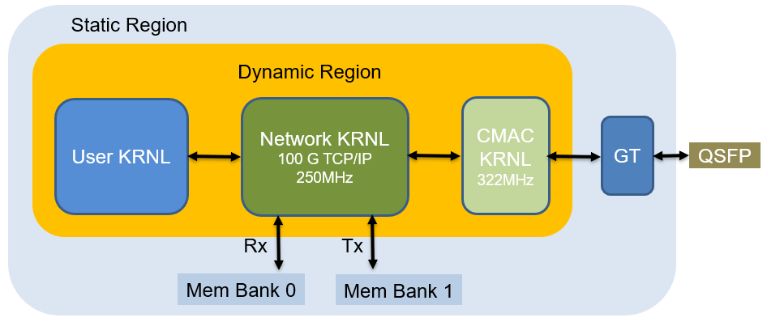
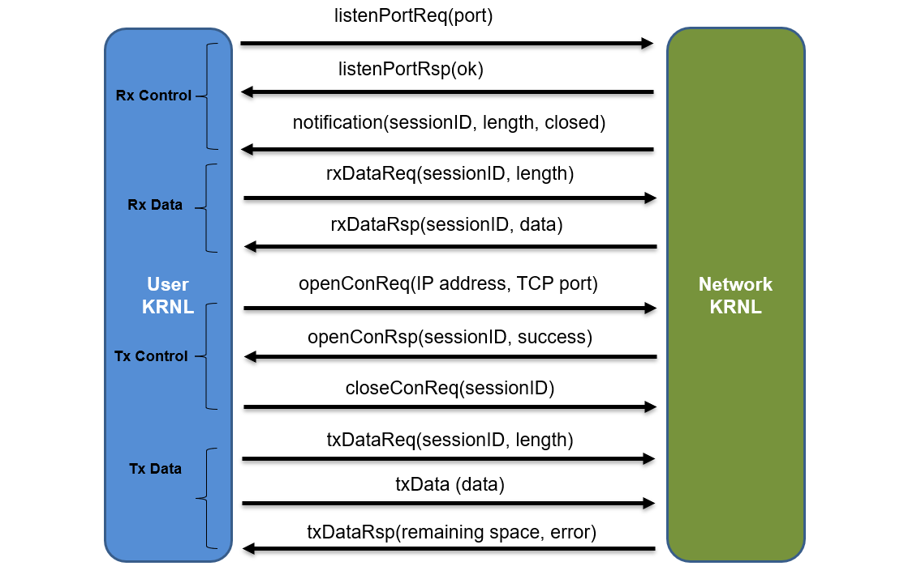
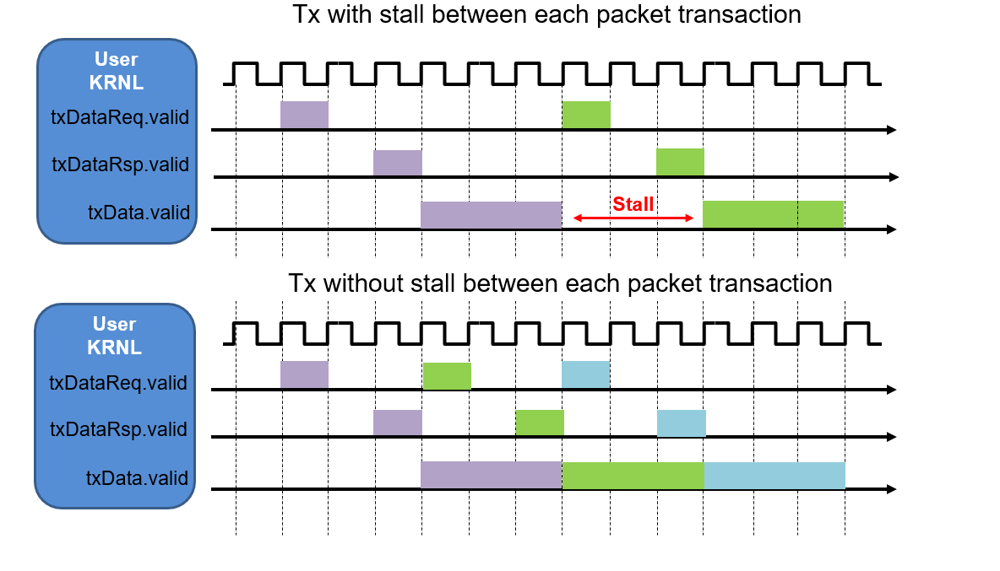

# Vitis with 100 Gbps TCP/IP Network Stack

This repository provides TCP/IP network support at 100 Gbit/s in Vitis and provides several examples to demonstrate the usage. 

## Architecture Overview

This repository creates designs with three Vitis kernels: `cmac` kernel, `network` kernel and `user` kernel. The `cmac` kernel and the `network` kernel serve as a common infrastructure for network functionality while the `user` kernel can be customized for each application.



### CMAC Kernel
The `cmac` kernel contains an UltraScale+ Integrated 100G Ethernet Subsystem. It is connected to the GT pins exposed by the Vitis shell and it runs at 100G Ethernet Subsystem clock, i.e.,322 MHz. It also exposes two 512-bit AXI4-Stream interfaces to the `network` kernel for Tx and Rx network packets. Internally the `cmac` kernel has CDC (clock domain crossing) logic to convert from `network` kernel clock to the 100G Ethernet Subsystem clock. 

### Network Kernel
The `network` kernel is a collection of HLS IP cores to provide TCP/IP network functionality. It can saturate 100 Gbps network bandwidth and it is clocked at 250 MHz. The kernel contains two 512-bit AXI4 interfaces to two memory banks, which serve as temporary buffers for Tx packet retransimission and Rx packet buffering respectively. The `network` kernel also exposes AXI4-Stream interfaces to the `user` kernel for openning and closing TCP/IP connection, sending and receiving network data. For a detailed description of the interface, please see below. The TCP/IP stack also contains several compile time parameters that can be tuned for performance benifit or resource saving for a specific application. For a more detailed description, please see [how to configure TCP/IP stack below](#configure-tcp-stack). 

### User Kernel
The `user` kernel contains AXI4-Stream interfaces to the `network` kernel and other interfaces that can be customized for each application. It is clocked at the same frequency as the `network` kernel. The `user` kernel can be developed in Vitis supported languages: RTL, C/C++ and OpenCL, and it should satisfy the requirement of the [Vitis application acceleration flow](https://www.xilinx.com/html_docs/xilinx2020_1/vitis_doc/kme1569523964461.html). This repository contains several examples written in RTL or C++ to illustrate how the `user` kernel could interact with the `network` kernel and to benchmark network statistic. 

## User-Network Kernel Interface
The AXI4-Stream interfaces between the `network` kernel and the `user` kernel is shown below. The interfaces can be divided into two paths: Rx and Tx. The structure of the interfaces can be found in [kernel/common/include/toe.hpp](kernel/common/include/toe.hpp).



On the RX path, the `user` kernel can put a TCP port into listening state through the listenPortReq interface and is notified about the port state change on the listenPortRsp interface. A Rx control handshake is required between the `user` and the `network` kernel before receving the payload. Through the notification interface, the `user` kernel is informed either about data available in the Rx Buffer or connection termination by the other end. To retrieve data from the Rx Buffer, the `user` kernel issues a request to the rxDataReq interface containing the session ID and length to be retrieved. This request is answered by the `network` kernel by providing the stream of data on the rxDataRsp interface.  

The `user` kernel can open active connections through the openConReq interface providing the IP address and TCP port of the destination. Through the openConRsp, it will then either receive the session ID of the new connection or be notified that the connection could not be established. The `user` kernel can close a connection by issuing the session ID to the closeConReq interface. To transfer data over an existing connection, a Tx control handshake is required before each payload transfer. The `user` kernel has to first provide the session ID and the length to the txDataReq interface. For each requested transfer, the TCP module will return a response on the txDataRsp interface indicating potential errors and the remaining buffer space for that connection. If the txDataRsp doesn't return any error, the `user` kernel can send the payload to the txData interface. Notice that for each transfer, it should not exceed the maximum segement size.

## How to Achieve 100 Gbps Tx and Rx Rate
Though the `network` kernel is capable of processing network packets at network rate, to actually achieve 100 Gbps rate at the `user` kernel, it requires a careful design with proper interaction with the `network` kernel and a proper tuning of the TCP/IP stack. Here we list three suggestions in order to achieve 100 Gbps at application level. 

### (1) Pipeline Control Handshake and Payload Transfer
For each Rx and Tx packet transfer, a control handshake between the `user` kernel and the `network` kernel is required before the actual payload receiving or transmitting. One straight forward way is to sequentially perform this "control handshake - payload transfer" for each transaction. However, due to complex logic control and registering in the TCP/IP stack, this control handshake process can take from 10 to 30 cycels. Considering the fact that it only takes 22 cycles for a payload transfer of 1408 bytes (64 bytes per cycle), the payload transfer process would be stalled for a substantial portion of time for each transaction. Therefore, in order to saturate the line rate, the control handshake and payload transfer for every consequtive transaction should be pipelined. Figure below shows example waveforms of the valid signal of Tx interfaces with and without pipelining between each transaction.   


### (2) Send Packets With Size of Multiple of 64 Bytes
During Tx process, the payload are buffered in global memory for retransmission in case of packet loss. This requires memory bandwidth of 100 Gbps if we want to saturate the network bandwidth. However, the memory access partern affects the memory bandwidth and especially with the Vitis shell, memory accesses with addresses not aligned to 64 byte would significantly decrease the memory bandwidth. In the case of sequential accesses with all unaligned memory addresses, the memory bandwidth is about only 25 Gbps, limiting the Tx rate. Therefore, it recommended to avoid unaligned memory access whenever possible and this can be achieved by sending packets with size of multiple of 64 bytes.  

### (3) Concurrent Connections and Large Maximum Transfer Unit (MTU) 
To achieve 100 Gbps at the application level, it requires that both end points of the communication can work at network rate. In the case of communicating between an FPGA and a CPU, it requires proper tunning on the CPU side to meet the network rate. First, concurrent connections should be establised and pinned on different threads. Second, large MTU (e.g., 4096 Bytes) should be set to reduce the overhead of packet parsing. 

## Performance Benchmark
For performance benchmark in terms of throughput and open connection time, please see [here](img/Vitis_100Gbps_TCP_benchmark.pdf).

## Clone the Repository

Git Clone 

	git clone	
	git submodule update --init --recursive

## Configure TCP Stack

Setup the TCP/IP stack HLS IPs:

    mkdir build
    cd build
    cmake .. -DFDEV_NAME=u280 -DTCP_STACK_EN=1 -DTCP_STACK_RX_DDR_BYPASS_EN=1 
    make installip


TCP/IP stack options:

| Name                   | Values                       | Desription                                                                         |
|------------------------|------------------------------|------------------------------------------------------------------------------------|
| TCP\_STACK\_MAX\_SESSIONS        | Integer                        | Maximum number of session supported by the stack. Each session requires a 64 KB Tx and Rx buffer in off-chip memory and state tables using on-chip memory. The choice of this parameter is a trade-off between maximum supported session count and resource usage. ; Default: 1000                                                                         |
| TCP\_STACK\_RX\_DDR\_BYPASS\_EN      |         <0,1>               | Bypassing Rx packets buffering. If user application can consume Rx packets at line-rate, setting this parameter allows the `network` kernel forward packets directly to the `user` kernel, which reduces global memory usage and latency. ; Default: 1                      |
| TCP\_STACK\_WINDOW\_SCALING\_EN |<0,1>                       | Enable TCP window scaling; Default: 1   

## Create Design

The following example command will synthesis and implement the design with selected `user` kernel. The generated XCLBIN resides in folder build_dir.hw.xilinx_u280_xdma_201920_3. The generated host executable resides in folder host.

    cd ../
    make all TARGET=hw DEVICE=/opt/xilinx/platforms/xilinx_u280_xdma_201920_3/xilinx_u280_xdma_201920_3.xpfm USER_KRNL=iperf_krnl USER_KRNL_MODE=rtl NETH=4

* `DEVICE` Alveo development target platform
* `USER_KRNL` Name of the user kernel
* `USER_KRNL_MODE` If the user kernel is a rtl kernel, rtl mode should be specified. If the user kernel is a C/C++ kernel, then hls mode should be specified.

Kernel options:

|  USER_KRNL                   | USER_KRNL_MODE                       | Desription                                                                         |
|------------------------|------------------------------|------------------------------------------------------------------------------------|
| iperf\_krnl         | rtl                        | Iperf kernel contains some HLS IPs and a rtl wrapper. It can be used to benchmark netowrk bandwidth acting as iperf2 client. Usage: ./host XCLBIN_FILE  [Server IP address in format 10.1.212.121] [#Connection] [Seconds]. The default port number of iperf2 is 5001.                                                                       |
| scatter\_krnl         | rtl                        |  Scatter kernel contains some HLS IPs and a rtl wrapper. It scatters packets through serveral connections. Usage: ./host XCLBIN_FILE  [IP address in format 10.1.212.121] [Base Port] [#Connection] [#Tx Pkg]. Kernel tries to open connections with different port numbers with incremental offset by the Base Port.                                                                      |
| hls\_send\_krnl        | hls                        | This kernel is a C kernel working in the VITIS HLS flow. It contains simple examples in C to open connection, send data through the connection. Usage: ./host XCLBIN_FILE  [#Tx Pkt] [IP address in format: 10.1.212.121] [Port]                                  |
| hls\_recv\_krnl      |  hls               | This kernel is a C kernel working in the VITIS HLS flow. It contains simple examples in C to listen on port and receive data from connection established with that port. Usage: ./host XCLBIN_FILE  [#RxByte] [Port]                     |

## Repository structure

~~~
├── fpga-network-stack
├── scripts
├── kernel
│   └── cmac_krnl
│   └── network_krnl
│   └── user_krnl
|		└── iperf_krnl
|		└── scatter_krnl
|		└── hls_send_krnl
|		└── hls_recv_krnl
├── host
|	└── iperf_krnl
|	└── scatter_krnl
|	└── hls_send_krnl
|	└── hls_recv_krnl
├── common
├── img
~~~

* fpga-network-stack: this folder contains the HLS code for 100 Gbps TCP/IP stack
* scripts: this folder contains scripts to pack each kernel and to connect cmac kernel with GT pins
* kernel: this folder contains the rtl/hls code of cmac kernel, network kernel and user kernel. User kernel can be configured to one of the example kernels 
* host: this folder contains the host code of each user kernel
* img: this folder contains images 
* common: this folder contains neccessary libraries for running the vitis kernel


## Support

### Tools

| Vitis  | XRT       |
|--------|-----------|
| 2022.1 | 2.13.466  |

### Alveo Cards

| Alveo | Development Target Platform(s) | 
|-------|----------|
| U280  | xilinx_u280_xdma_201920_3 | 
| U250  | xilinx_u250_gen3x16_xdma_3_1_202020_1 | 
| U50  | xilinx_u50_gen3x16_xdma_5_202210_1 |
| U55C  | xilinx_u55c_gen3x16_xdma_3_202210_1 |  
### Requirements

In order to generate this design you will need a valid [UltraScale+ Integrated 100G Ethernet Subsystem](https://www.xilinx.com/products/intellectual-property/cmac_usplus.html) license set up in Vivado.

## Acknowledgement
We would like to thank David Sidler for developing the prototype of 100 Gbps TCP/IP stack and Mario Daniel Ruiz Noguera for helpful discussion. We also thank Xilinx for generous donations of software and hardware to build the Xilinx Adaptive Compute Cluster (XACC) at ETH Zurich.

## Publication

###### If you use EasyNet, cite us :

```bibtex
@INPROCEEDINGS {easynet,
    author = {Z. He and D. Korolija and G. Alonso},
    booktitle = {2021 31st International Conference on Field-Programmable Logic and Applications (FPL)},
    title = {EasyNet: 100 Gbps Network for HLS},
    year = {2021},
    pages = {197-203},
    doi = {10.1109/FPL53798.2021.00040},
    url = {https://doi.ieeecomputersociety.org/10.1109/FPL53798.2021.00040},
    publisher = {IEEE Computer Society},
    address = {Los Alamitos, CA, USA},
    month = {sep}
}
```
